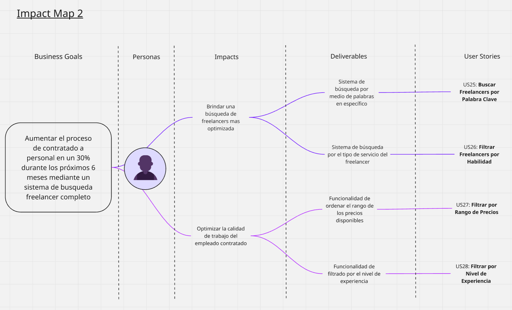

# Capítulo I: Introducción

### **1.1. Startup Profile**

#### **1.1.1. Descripción de la Startup**

Somos GigU, un equipo de estudiantes de la Universidad Peruana de Ciencias Aplicadas comprometidos con la innovación tecnológica y la creación de oportunidades para nuestra comunidad universitaria.

Nuestra misión es ofrecer una plataforma que permita a los estudiantes universitarios ofrecer sus habilidades y conocimientos a través de servicios freelance, generando ingresos adicionales mientras desarrollan experiencia profesional en su campo.

Nuestra visión es convertirnos en la principal plataforma de trabajo freelance para estudiantes en Perú y Latinoamérica, facilitando la conexión entre talento joven y clientes que buscan soluciones creativas y eficientes en múltiples áreas como desarrollo de software, diseño, tutorías, gestión empresarial, entre otros.

Nuestro producto principal es GigU, una plataforma que conecta a estudiantes con clientes interesados en servicios freelance. Los freelancers pueden publicar sus servicios, definir tarifas y cotizar precios de manera inteligente con base en factores como el tiempo estimado de trabajo, la complejidad del servicio y las tarifas del mercado. La plataforma también proporciona comunicación con clientes y procesamiento seguro de pagos.

GigU no solo ayuda a los estudiantes a generar ingresos mientras estudian, sino que también les permite desarrollar habilidades clave como la gestión del tiempo, la negociación, la resolución de problemas y el trato con clientes reales, preparándose así para la vida profesional.

Además, con GigU, los estudiantes tienen una forma flexible, accesible y efectiva de adquirir experiencia laboral y construir una red de clientes y contactos profesionales desde el inicio de su carrera.

#### **1.1.2. Perfiles de integrantes del equipo**

**Tabla 1**  
*Perfil del integrante Mariano Moisés Oblitas Dávila*

| Nombre: Oblitas Dávila, Mariano Moisés  |   |
| :---- | :---- |
| **Código:** U202310222 |  |
| **Carrera:** Ingeniería en software |  |
| **Habilidades:** Estudiante de 18 años de Ingeniería de Software en la UPC. Me caracterizo por mi creatividad, eficacia y capacidad para resolver problemas de manera racional. Apasionado por la programación y el desarrollo de software, busco constantemente innovar y aprender nuevas tecnologías. |  || Nombre: Cacho Seminario, Diego Alonso |   |

| Nombre: Martinez Ramos,Bryan Felix  |   |
| :---- | :---- |
| **Código:** U202316246 |  |
| **Carrera:** Ingeniería en software |  |
| **Habilidades:** Soy estudiante de la carrera de ingeniería de software de la universidad Peruana de ciencias aplicadas, soy una persona comprometida y responsable, priorizo mucho mis responsabilidades y siempre trato de cumplir mis trabajos en los tiempos establecidos, tengo experiencia en lenguajes de programación como C++ Python y conocimientos muy básicos en solidity que pienso consolidarlos en el futuro proyecto, tengo habilidades en algunos lenguajes de programación como C + +,python y un poco de html. |  |

| Nombre: Cacho Seminario, Diego Alonso  |  |
| :---- | :---- |
| **Código:** U202223990 |  |
| **Carrera:** Ingeniería de Software |  |
| **Habilidades:** Soy estudiante de Ingeniería de Software cursando el 6to ciclo de mi carrera en la UPC y tengo 20 años. Me considero una persona tranquila y diligente, intentó realizar mis tareas y trabajos lo antes posible para evitar contratiempos en un futuro, especialmente si son actividades que consumen mucho tiempo. Como miembro de equipo buscaré ayudar a mis compañeros cuando lo necesiten, realizando además mis entregas lo más temprano posible. Habilidades en C++, C\#, Python, Unity 2D/3D, html/css/js. |  |

| Nombre: Solis Santa Cruz,Giancarlo Rafael                                                                                                                                                                                                                                                                                                                                                                                                                                                                                                                                                                               |  |
| :---------------------------------------------------------------------------------------------------------------------------------------------------------------------------------------------------------------------------------------------------------------------------------------------------------------------------------------------------------------------------------------------------------------------------------------------------------------------------------------------------------------------------------------------------------------------------------------------------------------------- | :----------------------------------------------------------------------------------- |
| **Código:** U202318615                                                                                                                                                                                                                                                                                                                                                                                                                                                                                                                                                                                                  |                                                                                      |
| **Carrera:** Ingeniería de Software                                                                                                                                                                                                                                                                                                                                                                                                                                                                                                                                                                                     |                                                                                      |
| **Habilidades:** Soy estudiante de Ingeniería de Software cursando el 5to ciclo de mi carrera en la UPC y tengo 22 años. Soy una persona proactiva e intuitiva. Me gusta abordar mis tareas de manera eficiente, completándolas con anticipación para evitar problemas futuros, especialmente cuando se trata de proyectos largos o complejos. En equipo, me esfuerzo por colaborar y apoyar a mis compañeros en todo lo que pueda, asegurándome de cumplir con mis entregas a tiempo o incluso antes. Tengo experiencia en programación con C + +, Java, Python, así como en el diseño web con html, CSS y JavaScript. |                                                                                      |
| Nombre: Diego Seijas                                                                                                                                                                                                                                                                                                                                                                                                                                                                                                                                                                                                    |          |
| **Código:** U202210167                                                                                                                                                                                                                                                                                                                                                                                                                                                                                                                                                                                                  |                                                                                      |
| **Carrera:** Ingeniería de Software                                                                                                                                                                                                                                                                                                                                                                                                                                                                                                                                                                                     |                                                                                      |
| **Habilidades:** Soy estudiante de Ingeniería de Software cursando el 7to ciclo de mi carrera en la UPC y tengo 20 años. Soy una persona proactiva. Me gusta abordar mis tareas de manera eficiente,  especialmente cuando se trata de proyectos largos o complejos. En equipo, me esfuerzo por colaborar y apoyar a mis compañeros en todo lo que pueda. Tengo experiencia en programación con C + +, Java, Python, así como en el diseño web con html, CSS y JavaScript.                                                                                                                                              |                                                                                      |
| Nombre: Irving Allcca                                                                                                                                                                                                                                                                                                                                                                                                                                                                                                                                                                                                    |          |
| **Código:** U202213241                                                                                                                                                                                                                                                                                                                                                                                                                                                                                                                                                                                                |                                                                                      |
| **Carrera:** Ingeniería de Software                                                                                                                                                                                                                                                                                                                                                                                                                                                                                                                                                                                     |                                                                                      |
| **Habilidades:** Soy estudiante de Ingeniería de Software cursando el 5to ciclo de mi carrera en la UPC y tengo 20 años. Soy una persona empática e intuitiva. Me gusta desarrollar los proyectos de manera secuencial y eficiente. En equipo, me esfuerzo por colaborar. Tengo experiencia en programación con C + +, Java, Python, así como en el diseño web con html, CSS y JavaScript.                                                                                |                                                                                      |
| Nombre: Renato Yauri Chocce                                                                                                                                                                                                                                                                                                                                                                                                                                                                                                                                                                                                    |          |
| **Código:** U202317566                                                                                                                                                                                                                                                                                                                                                                                                                                                                                                                                                                                                |                                                                                      |
| **Carrera:** Ingeniería de Software                                                                                                                                                                                                                                                                                                                                                                                                                                                                                                                                                                                     |                                                                                      |
| **Habilidades:** Soy estudiante de Ingeniería de Software cursando el 5to ciclo de mi carrera en la UPC y tengo 21 años. Soy una persona amable y tranquila. Me gusta desarrollar los proyectos de manera minuciosa. En equipo, me esfuerzo por colaborar. Tengo experiencia con C++, Java, JavaScript, html y CSS.                                                                                                                                                     |                                                                                      |

### **1.2. Solution Profile** 

#### **1.2.1. Antecedentes y Problemática**

##### **¿Cuál es el problema?**  
Muchos estudiantes universitarios enfrentan serias dificultades para generar ingresos y adquirir experiencia profesional mientras cursan sus estudios. Esta carencia de oportunidades laborales adecuadas no solo limita su independencia económica, sino también el desarrollo temprano de habilidades prácticas y su inserción competitiva en el mercado laboral. Según datos del Ministerio de Educación del Perú (2020), aproximadamente el 20% de los estudiantes universitarios de entre 17 y 21 años combina estudios y trabajo de manera simultánea, reflejando que una parte importante de la población estudiantil se ve obligada a buscar ingresos mientras completa su formación. Sin embargo, a pesar de contar con talentos y conocimientos valiosos, la mayoría no dispone de una plataforma accesible, segura y adaptada que les permita ofrecer sus servicios de forma organizada y profesional, especialmente bajo la modalidad freelance.

##### **¿Cuándo ocurre el problema?**  
El problema se presenta a lo largo de toda la etapa universitaria, con mayor énfasis a partir del segundo o tercer año de carrera, cuando los estudiantes ya han adquirido capacidades técnicas, académicas o creativas que podrían ser aplicadas en el ámbito laboral. La necesidad de generar ingresos se intensifica en periodos críticos como matrículas, proyectos finales o gastos personales, momentos en los que la presión financiera se convierte en un factor determinante para su permanencia y rendimiento académico.

##### **¿Dónde ocurre el problema?**  
Esta problemática es evidente en el contexto universitario peruano y latinoamericano, especialmente en instituciones donde las políticas de empleabilidad son limitadas o inexistentes, y donde los programas de prácticas preprofesionales o los vínculos con el mercado freelance son insuficientes o inaccesibles. Asimismo, en el entorno digital persiste la falta de una plataforma centralizada y especializada que facilite a los estudiantes la oferta de servicios freelance de manera organizada, validada y segura.

##### **¿A quién afecta el problema?**  
El problema impacta directamente a estudiantes universitarios que buscan generar ingresos, adquirir experiencia laboral temprana y construir un portafolio real antes de egresar. Esta situación también afecta a microempresas, emprendedores y particulares que requieren servicios profesionales accesibles, confiables y de calidad, y que a menudo no logran encontrar talento joven disponible y verificado en su entorno inmediato.

##### **¿Por qué sucede el problema?**  
El problema radica en la falta de plataformas diseñadas específicamente para conectar estudiantes con clientes potenciales, considerando sus limitaciones de tiempo, experiencia y recursos. Las plataformas freelance tradicionales imponen barreras de entrada significativas, como comisiones elevadas, competencia global desproporcionada y escasa validación académica de perfiles, lo que desalienta la participación de estudiantes y perpetúa su informalidad laboral.

##### **¿Cómo sucede el problema?**  
En ausencia de alternativas formales y especializadas, los estudiantes optan por ofrecer sus servicios a través de redes sociales, contactos personales o plataformas genéricas que no garantizan seguridad, visibilidad ni condiciones laborales justas. Esta informalidad expone a los estudiantes a malas prácticas, incumplimientos de pago, sobreexplotación de tiempo y escaso reconocimiento de sus capacidades, lo que frecuentemente deriva en frustración, desmotivación y experiencias laborales negativas.

##### **¿Cuán grande es el impacto de este problema?**  
El impacto es considerable tanto en el plano individual como en el social. En el Perú, el 85.3% de jóvenes menores de 25 años trabaja en condiciones de informalidad, lo que evidencia una fuerte precarización del empleo juvenil y una limitada protección social (INEI, 2023). Además, la tasa de desempleo en jóvenes de 14 a 24 años alcanza el 10.1%, superando al promedio nacional y posicionando a este grupo como uno de los más vulnerables del mercado laboral (INEI, 2023). Esta realidad afecta directamente su desarrollo personal y profesional, retrasa su independencia económica y limita su proyección laboral futura.

##### 

##### 

#### **1.2.2. Lean UX Process**

##### **1.2.2.1. Lean UX Problem Statements**

En el contexto universitario peruano, los estudiantes enfrentan grandes desafíos para insertarse en el mercado laboral mientras cursan sus estudios. La mayoría se enfrenta a condiciones de informalidad o desempleo, lo cual limita su desarrollo profesional desde una etapa temprana.  
 Hemos observado que no existen plataformas efectivas y especializadas que conectan directamente a estudiantes universitarios con oportunidades laborales formales, flexibles y alineadas a sus carreras, lo cual perpetúa la falta de experiencia profesional al egresar.  
 ¿Cómo podemos ayudar a los estudiantes universitarios en el Perú a insertarse en el mercado laboral de forma formal, flexible y segura durante su etapa académica, permitiéndoles desarrollar habilidades prácticas, generar ingresos y mejorar su empleabilidad desde los primeros ciclos?
 
 ##### **1.2.2.2. Lean UX Assumptions**

¿Quién es el usuario?  
 Estudiantes universitarios peruanos, principalmente entre los 17 y 24 años, que buscan generar ingresos y experiencia profesional compatible con sus horarios académicos.

¿Dónde encaja nuestro producto en su vida?  
ConnectED se integra como una herramienta esencial para complementar su formación académica con experiencia laboral real, generar ingresos, y conectarse con profesionales, clientes o mentores, sin sacrificar su rendimiento académico.

¿Qué problemas tiene nuestro producto y cómo se pueden resolver?

* Posible desconfianza hacia la formalidad de las oportunidades.  
   → Solución: verificación de empleadores/clientes y contratos inteligentes.

* Dificultad para encontrar tareas relacionadas a su carrera.  
   → Solución: sistema de categorización inteligente por carreras y habilidades.

* Baja retención o uso esporádico.  
   → Solución: gamificación, badges y recompensas por participación activa.

¿Cómo y cuándo es usado nuestro producto?  
El producto es usado principalmente durante los tiempos libres o entre clases. Los estudiantes lo utilizan para buscar encargos, postular a proyectos freelance, recibir feedback, y conectarse con mentores o empresas pequeñas que necesitan apoyo técnico o creativo.

¿Qué características son importantes?

* Perfiles profesionales con historial académico y de proyectos.

* Oportunidades freelance o part-time verificadas.

* Inteligencia artificial para emparejar tareas con habilidades.

* Retroalimentación entre estudiantes y clientes.

* Panel de seguimiento de experiencia acumulada.

* Integración con LinkedIn y portafolios.

* Sistema de reputación y badges.

* Chat seguro entre clientes y postulantes.

* Acceso a micro cursos gratuitos recomendados según proyectos.

¿Cómo debe verse nuestro producto y cómo comportarse?  
 Debe tener un diseño moderno, amigable y responsivo. Su comportamiento debe ser fluido, con tiempos de carga bajos y navegación clara. La experiencia de usuario debe motivar la interacción constante, con notificaciones relevantes y recomendaciones que generen valor real para el usuario.

##### **1.2.2.2. Lean UX Assumptions**

¿Quién es el usuario?  
 Estudiantes universitarios peruanos, principalmente entre los 17 y 24 años, que buscan generar ingresos y experiencia profesional compatible con sus horarios académicos.

¿Dónde encaja nuestro producto en su vida?  
ConnectED se integra como una herramienta esencial para complementar su formación académica con experiencia laboral real, generar ingresos, y conectarse con profesionales, clientes o mentores, sin sacrificar su rendimiento académico.

¿Qué problemas tiene nuestro producto y cómo se pueden resolver?

* Posible desconfianza hacia la formalidad de las oportunidades.  
   → Solución: verificación de empleadores/clientes y contratos inteligentes.

* Dificultad para encontrar tareas relacionadas a su carrera.  
   → Solución: sistema de categorización inteligente por carreras y habilidades.

* Baja retención o uso esporádico.  
   → Solución: gamificación, badges y recompensas por participación activa.

¿Cómo y cuándo es usado nuestro producto?  
El producto es usado principalmente durante los tiempos libres o entre clases. Los estudiantes lo utilizan para buscar encargos, postular a proyectos freelance, recibir feedback, y conectarse con mentores o empresas pequeñas que necesitan apoyo técnico o creativo.

¿Qué características son importantes?

* Perfiles profesionales con historial académico y de proyectos.

* Oportunidades freelance o part-time verificadas.

* Inteligencia artificial para emparejar tareas con habilidades.

* Retroalimentación entre estudiantes y clientes.

* Panel de seguimiento de experiencia acumulada.

* Integración con LinkedIn y portafolios.

* Sistema de reputación y badges.

* Chat seguro entre clientes y postulantes.

* Acceso a micro cursos gratuitos recomendados según proyectos.

¿Cómo debe verse nuestro producto y cómo comportarse?  
 Debe tener un diseño moderno, amigable y responsivo. Su comportamiento debe ser fluido, con tiempos de carga bajos y navegación clara. La experiencia de usuario debe motivar la interacción constante, con notificaciones relevantes y recomendaciones que generen valor real para el usuario.

##### **1.2.2.3. Lean UX Hypothesis Statements**

* Creemos que al conectar estudiantes universitarios con oportunidades laborales compatibles con sus carreras y horarios, lograremos que desarrollen experiencia profesional antes de egresar.  
   Sabremos que hemos tenido éxito cuando más del 50% de los usuarios activos complete al menos una tarea remunerada en su primer mes.

* Creemos que implementar un sistema de reputación y gamificación aumentará la participación y compromiso con la plataforma.  
   Sabremos que hemos tenido éxito cuando el tiempo promedio de uso semanal supere los 45 minutos por usuario activo.

* Creemos que ofrecer oportunidades relacionadas a sus habilidades y carrera aumentará su satisfacción y fidelización.  
   Sabremos que hemos tenido éxito cuando al menos el 70% de los usuarios califique la relevancia de las recomendaciones como “alta” o “muy alta”.

##### **1.2.2.4. Lean UX Canvas**

#### 

#### **1.3. Segmentos Objetivo**

- ##### **Estudiantes Universitarios Freelancers**

Estudiantes de cualquier ciclo universitario que buscan ofrecer sus servicios de manera independiente para adquirir experiencia laboral, generar ingresos y construir una red de clientes. Estos estudiantes pueden pertenecer a diversas especialidades como diseño gráfico, programación, marketing digital, redacción, tutorías académicas, entre otros.

Características:

* Buscan oportunidades de trabajo flexible que les permitan combinar sus estudios con el trabajo freelance.

* Necesitan herramientas que los ayuden a promocionar sus habilidades y construir una cartera de clientes.

* Valoran la facilidad de pago y la seguridad en la gestión de contratos.

- ##### **Personas y Emprendimientos  que buscan contratar servicios freelance**

Individuos o empresas que requieren servicios especializados sin la necesidad de contratar empleados a tiempo completo. Esto incluye emprendedores, startups, pequeñas empresas y particulares que buscan soluciones rápidas y accesibles para sus proyectos.

Características:

* Buscan talento accesible y de calidad para tareas específicas.

* Prefieren plataformas que garanticen la seguridad en la contratación y el cumplimiento del trabajo.

* Valoran las recomendaciones y validaciones de otros clientes para elegir freelancers confiables.
  
# Capítulo II: Requirements Elicitation & Analysis

### **2.1. Competidores**

Los competidores que hemos identificado para GigU son las plataformas freelancer, aunque no existen plataformas que estén 100% enfocadas en estudiantes como lo realiza GigU, si presenta productos con mucha similaridad lo que genera una competencia directa.

#### **2.1.1 Análisis Competitivo**

#### **2.1.2 Estrategias y tácticas frente a competidores**

GigU aplicará una estrategia de diferenciación enfocada en el talento universitario, destacando por su enfoque educativo, precios accesibles y alianzas con instituciones académicas. Frente a los grandes competidores del mercado freelance, GigU se posiciona como una alternativa confiable y de propósito social, conectando clientes con estudiantes verificados. Su valor está en ofrecer soluciones personalizadas, soporte en español y una experiencia centrada en el desarrollo profesional de los jóvenes. Aprovechará las debilidades de otras plataformas como su falta de personalización o enfoque regional, mientras mitiga amenazas como la falta de experiencia estudiantil con garantías y filtros de calidad

### **2.2. Entrevistas**

### **2.2.1 Diseño de entrevistas**

### **2.2.2 Registro de Entrevistas**

<b><u>Segmento objetivo #1: Estudiantes Universitarios Freelancers</u></b>

Entrevistado N°1: Mario André Cacho Seminario

* Sexo: Masculino  
* Edad: 21  
* Ubicación en la que vive: Surco

Acerca de la entrevista:

* Link: [https://youtu.be/hSg2bZ3Jgbc](https://youtu.be/hSg2bZ3Jgbc)   
* Instante en el que inicia: 0:10  
* Duración: 3:26

Resumen:

Para Mario, ofrecer servicios como freelancer en la creación de videos de marketing para pequeñas empresas le ha permitido impulsar su desarrollo personal y profesional. Le motiva expandir su perspectiva trabajando con distintos tipos de negocios. Sin embargo, encuentra complicado conseguir clientes, ya que considera que ser estudiante limita su contratación por parte de empresas que priorizan la experiencia. Por lo general, encuentra oportunidades a través de redes sociales o contactos cercanos, y recibe sus pagos mediante transferencias bancarias directas. Dedica entre 6 y 8 horas semanales al trabajo freelance, equilibrándolo con sus estudios. Cree que una plataforma ideal debería permitir visibilidad a personas de todos los niveles (estudiantes, aficionados, profesionales) y contar con un sistema que sugiera proyectos según habilidades y experiencia. También valora que exista un historial de trabajos realizados y, sobre todo, un sistema de cobros seguro que proteja su esfuerzo.

<b><u>Segmento objetivo #2: Personas y Emprendimientos que buscan contratar servicios freelance</u></b>

Entrevistado N°2: Janet Ramos Soto

* Sexo: Femenino  
* Edad: 50  
* Ubicación en la que vive: Villa El Salvador  

**Acerca de la entrevista:**

* Link: [Ver video](https://drive.google.com/file/d/1GrgiPOIVxOZlzbkVRIbqKf3GxdKc92Cs/view?usp=sharing)  
* Instante en el que inicia: 0:08 segundos  
* Duración: 6:16 minutos  

**Resumen:** Janet es una emprendedora de tienda de zapatillas la cual debido a su crecimiento tuvo un incremento considerable de tareas, lo cual llevó a que durante algún momento buscara un trabajador freelance para disminuir su trabajo.  

**Canales actuales para buscar freelancer:**  
Nos comenta que únicamente ha contratado freelancer por medio de la plataforma fiverr  

**Criterios para confiar en un freelancer:**  
* Comentarios de los clientes sobre proyectos pasados  
* Portafolio o muestra de trabajos pasados  
* Tiempo de experiencia como trabajador freelancer  

Ella misma prefiere gestionar el proceso del pago ya que debido a su edad no se le da bien el pago de los proyectos.  

**Motivos para descartar a un freelancer:**  
* Mala reputación como trabajador  
* Poco tiempo de experiencia  
* Poco interés/compromiso en el proyecto  

**Características deseadas en una plataforma freelance:**  
* Detalles claros en la plataforma  
* Costos del proyecto detallado  
* Acceso a la información y comentarios del freelancer  

Ella prefiere no negociar ya que siente que si el proyecto que solicita al freelancer es complejo y está muy bien hecho pagaría lo cobrado por el freelancer o la plataforma  

**Factores de decisión:**  
Considera lo más determinante la opinión de otros usuarios sobre la experiencia trabajando con el freelancer.  

### **2.3. NeedFinding** 

#### **2.3.1 User Persona** 

User Persona del Usuario estudiante Freelancer

User Persona del Usuario Persona o emprendimiento

#### **2.3.2 User Task Matrix**

En esta se presenta el user task matrix, herramienta centrada en los segmentos objetivos que nos permitirá identificar las tareas y objetivos claves de los usuarios.

| USER TASK  | Julio Bernal |  | Luisa Fuentes |  |
| :---- | ----- | :---- | ----- | :---- |
|  | Frequency | Importance | Frequency | Importance |
| Publicar servicios y mostrar habilidades | Often | High | Sometimes | High |
| Cotizar precios fácilmente según tipo de trabajo | Sometimes | High | Often | High |
| Encontrar oportunidades mediante una app centralizada | Sometimes | High | Often  | Medium |
| Procesar pagos seguros a través de la plataforma | Always  | High | Always | High |
| Mostrar historial de trabajos realizados | Sometimes | Medium | Often | Medium |
| Negociar precios dentro de un rango flexible | Sometimes | Medium | Always | High |
| Establecer acuerdos y comunicación en la plataforma | Often | High | Always | High |

#### **2.3.3 User Journey Mapping**

User Journey estudiante freelance

User Journey persona o empresa:

#### **2.3.4 Empathy Mapping**

En esta sección se presenta el Empathy Mapping, herramienta para crear un perfil detallado de los user personas y desarrollar una comprensión profunda de su perspectiva y experiencia. Para cada user persona, se incluyen cinco elementos clave: lo que el usuario ve, lo que el usuario escucha, lo que el usuario dice, lo que el usuario hace y lo que el usuario siente. Además, se incluyen los pains y gains identificados en base a las preguntas: ¿Qué le preocupa?

Empathy mapping de estudiante freelance:

Empathy mapping de persona o empresa:

#### **2.3.5 AS-IS Mapping**

Se realizaron los siguientes cuadros en la herramienta Miro, el link original puede ser observado aquí: 

[LINK AS-IS](https://miro.com/welcomeonboard/SHJEektJMkxMZFNycTN4eVVtVUJ4a0d5VTk2amQ5dGJLWS9UTGU3Nm10aDQ1SmlCUkI2ZjYwZm93NS9nVGo3K1lLdU1EVmV4blFVK0prZHQ5VjRyR1gxNXJHS2xQcGJUQW1JS1Z3eW9pQVZHOUFLRXJNT2Z3OWU2SHJwT2ttOERBd044SHFHaVlWYWk0d3NxeHNmeG9BPT0hdjE=?share_link_id=926791313064)

As-Is Scenario Mapping para Estudiantes Universitarios Freelancers

As-Is Scenario Mapping para Personas y Emprendimientos que buscan contratar servicios Freelance

### **2.3. Ubiquitous Language.** 

* **Freelancer:** Estudiante que ofrece servicios a través de la plataforma.

* **Cliente:** Persona o emprendimiento que contrata servicios dentro de la plataforma.

* **Servicio:** Habilidad o trabajo ofrecido por un freelancer.

* **Perfil:** Información pública de un freelancer, incluyendo habilidades y experiencia.

* **Proyecto:** Trabajo definido que necesita ser realizado por un freelancer.

* **Solicitud de Proyecto:** Pedido que realiza un cliente para contratar un servicio.

* **Oferta:** Propuesta de precio y condiciones que un freelancer presenta para un proyecto.

* **Acuerdo:** Confirmación del cliente y freelancer sobre las condiciones de un proyecto.

* **Resumen de Servicio:** Descripción formal de lo que se entregará en un proyecto.

* **Entrega:** Resultado final que el freelancer entrega al cliente.

* **Estado del Proyecto:** Etapa actual de un proyecto (pendiente, en progreso, entregado, finalizado).

* **Calificación:** Puntuación que refleja la calidad del servicio entregado.

* **Comentario:** Reseña escrita sobre la experiencia de trabajo en un proyecto.

* **Historial:** Registro de proyectos completados por freelancers y clientes.

* **Notificación:** Mensaje generado por el sistema para informar sobre acciones relevantes.

* **Ámbito:** Categoría profesional que agrupa servicios similares.

* **Método de Pago:** Sistema mediante el cual se realiza la transacción económica.

* **Reputación:** Indicador basado en calificaciones y comentarios de proyectos finalizados.

* **Negociación:** Interacción en la que cliente y freelancer ajustan precio y condiciones.

* **Plataforma:** Espacio digital donde se conectan clientes y freelancers.

**

### **3.1. To-Be Scenario Mapping.** 

Se realizaron los siguientes cuadros en la herramienta Miro, el link original puede ser observado aquí: 

[LINK TO-BE](https://miro.com/app/board/uXjVIFvzuZo=/?share_link_id=785027992176)

* To-Be Scenario Mapping para Estudiantes Universitarios Freelancers

* To-Be Scenario Mapping para Personas y Emprendimientos que buscan contratar servicios Freelance

### **3.2. User Stories.** 

* EPICS

Las epics definidas para el proyecto GigU están orientadas a cubrir las necesidades principales tanto de los estudiantes de la UPC como de los usuarios que buscan contratar servicios freelance. Estas epics abordan funcionalidades esenciales para el funcionamiento de la plataforma, asegurando una experiencia fluida y efectiva desde la publicación de habilidades por parte de los estudiantes hasta la contratación por parte de clientes o emprendimientos. Desde la interfaz de la landing page, donde los usuarios conocen la propuesta de valor de GigU, hasta la gestión técnica del backend, frontend y servicios web, las epics actúan como una guía estructurada que facilita el desarrollo progresivo y coherente del sistema, alineándose con los objetivos académicos y de empleabilidad del proyecto.

| Epic / Story ID | Título | Descripción |
| :---: | ----- | ----- |
| EP01 | Navegación en Landing Page | Como visitante de GigU, deseo poder navegar de forma intuitiva por la landing page para conocer los beneficios de contratar o publicar servicios. |
| EP02 | Autenticación y Registro de Usuarios | Como usuario nuevo, deseo registrarme e iniciar sesión utilizando correo o redes sociales para acceder a mi cuenta de manera rápida y segura. |
| EP03 | Recuperación de Contraseña | Como usuario registrado, deseo recuperar mi contraseña fácilmente para poder acceder nuevamente en caso de olvidarla. |
| EP04 | Visualización de Servicios y Beneficios | Como visitante, deseo conocer los tipos de servicios disponibles y cómo funciona GigU para saber cómo puede ayudarme a contratar o ser contratado. |
| EP05 | Soporte y FAQ | Como visitante, deseo acceder a una sección de preguntas frecuentes y soporte para resolver mis dudas de forma autónoma y rápida. |
| EP06 | Gestión de Perfil Freelance | Como estudiante, deseo crear y editar mi perfil público con información, habilidades y precios para que posibles clientes conozcan mis servicios. |
| EP07 | Publicación y Edición de Servicios | Como estudiante, deseo publicar servicios personalizados con precios, plazos y descripciones claras para atraer clientes interesados. |
| EP08 | Búsqueda y Filtro de Freelancers | Como cliente, deseo buscar freelancers y filtrar por habilidades, precio o disponibilidad para encontrar al más adecuado para mi proyecto. |
| EP09 | Sistema de Contratación Directa | Como cliente, deseo contratar directamente a un freelancer desde su perfil para simplificar el proceso de contratación. |
| EP10 | Gestión de Proyectos y Solicitudes | Como freelancer, deseo gestionar las solicitudes recibidas y proyectos activos para poder organizar mejor mi trabajo y tiempos. |
| EP11 | Calificaciones y Opiniones | Como usuario, deseo dejar y ver calificaciones y comentarios sobre los freelancers para tomar decisiones más informadas. |
| EP12 | Sistema de Mensajería Interna | Como usuario, deseo comunicarme directamente dentro de la plataforma con el otro usuario para coordinar detalles antes o durante un proyecto. |
| EP13 | Cálculo Inteligente de Precio del Servicio | Como usuario, deseo que la plataforma sugiera un precio justo basado en la propuesta del freelancer, la oferta del cliente, el tipo y tamaño del servicio, y la experiencia del freelancer, para facilitar acuerdos equilibrados entre ambas partes. |

* User Stories

| Epic / Story ID | Título | Descripción | Criterios de Aceptación | Relacionado con (Epic ID) |
| :---: | ----- | ----- | ----- | :---: |
| US01 | Navegación Intuitiva en la Landing Page | Como visitante de GigU, deseo que la landing page tenga una barra de navegación clara y accesible para encontrar fácilmente las secciones importantes. | **Escenario 01:** Given que estoy en la landing page, When hago clic en el menú, Then debería ver opciones como “Inicio”, “Buscar Freelancer”, “Publicar Proyecto” y “Sobre Nosotros”. **Escenario 02:** Given que paso el cursor sobre un ítem, When el ítem está activo, Then debería resaltarse. | EP01 |
| US02 | Acceso rápido a funcionalidades clave | Como visitante, deseo acceder desde la landing page a secciones clave como “Publicar proyecto” o “Registrarse” para actuar rápidamente. | **Escenario 01:** Given que estoy en la landing, When hago scroll, Then debería ver botones CTA como “Empieza a contratar” o “Regístrate como freelancer”. **Escenario 02:** Given que estoy en la landing, When hago clic en un botón CTA como “Regístrate como freelancer”, Then debería ser redirigido al formulario de registro. | EP01 |
| US03 | Registro con Correo y Contraseña | Como nuevo usuario, deseo poder registrarme en la plataforma con mi correo y contraseña para acceder a las funcionalidades de GigU. | **Escenario 01:** Given que estoy en la sección de registro, When ingreso un correo válido y contraseña, Then debería registrarme correctamente. **Escenario 02:** Given que intento registrarme con datos inválidos, When presiono “Register”, Then debería recibir un mensaje de error. | EP02 |
| US04 | Iniciar sesión como Freelancer o Cliente | Como usuario registrado, deseo poder iniciar sesión para acceder a mi cuenta y funcionalidades específicas según mi rol. | **Escenario 01:** Given que tengo una cuenta, When ingreso mis credenciales, Then debería entrar como Freelancer o Cliente dependiendo del rol configurado. **Escenario 02**: Given que ingreso credenciales incorrectas, When presiono “Login”, Then debería recibir un mensaje de error indicando acceso denegado. | EP02 |
| US05 | Registro con redes sociales | Como visitante, deseo registrarme con Google para agilizar el proceso de creación de cuenta. | **Escenario 01:** Given que estoy en la vista de registro, When hago clic en “Registrarse con Google”, Then debería autenticarme y crear mi cuenta automáticamente. **Escenario 02**: Given que mi cuenta de Google ya está vinculada, When intento registrarme nuevamente con Google, Then debería mostrar un mensaje indicando que la cuenta ya existe. | EP02 |
| US06 | Solicitar recuperación de contraseña | Como usuario, deseo solicitar la recuperación de mi contraseña para volver a acceder si la olvido. | **Escenario 01:** Given que olvidé mi contraseña, When ingreso mi correo en la sección “Forgot your password”, Then debería recibir un correo con un enlace de recuperación. **Escenario 02**: Given que ingreso un correo no registrado, When presiono “Recuperar contraseña”, Then debería mostrar un mensaje indicando que el correo no existe en el sistema. | EP03 |
| US07 | Restablecer contraseña vía correo | Como usuario, deseo poder restablecer mi contraseña desde un enlace de recuperación enviado a mi correo. | **Escenario 01**: Given que he recibido el correo de recuperación, When hago clic en el enlace, Then debería poder establecer una nueva contraseña válida. **Escenario 02**: Given que ingreso una nueva contraseña que no cumple con los requisitos, When intento guardarla, Then debería mostrarse un mensaje de validación indicando el error. | EP03 |
| US08 | Conocer los beneficios de GigU | Como visitante, deseo conocer los beneficios de usar GigU para saber por qué debería usar esta plataforma. | **Escenario 01:** Given que estoy en la landing, When accedo a “About us”, Then debería ver beneficios como flexibilidad, soporte al talento joven y precios accesibles. **Escenario 02**: Given que veo los beneficios, When hago clic en uno de ellos, Then debería abrirse un pequeño resumen explicativo o una ventana emergente con más información. | EP04 |
| US09 | Diferencias entre roles (freelancer / cliente)	 | Como visitante, deseo saber las diferencias entre registrarme como freelancer o cliente para elegir el rol adecuado. | **Escenario 01**: Given que estoy revisando roles, When veo la sección de “Roles”, Then debería ver descripciones separadas y sus beneficios. **Escenario 02**: Given que estoy revisando la sección de roles, When hago click en “Freelancer” o “Customer”, Then debería desplegarse información adicional sobre el flujo de cada tipo de usuario. | EP04 |
| US10 | Experiencias de otros usuarios | Como visitante, deseo ver testimonios de usuarios anteriores para confiar en la plataforma. | **Escenario 01:** Given que estoy en la sección de experiencias, When visualizo un testimonio, Then debería ver nombre, rol y comentario del usuario. **Escenario 02**: Given que estoy en la sección de experiencias, When hago clic en “Ver más”, Then debería expandirse una lista con testimonios adicionales. | EP04 |
| US11 | Detalles sobre tipos de servicios | Como visitante, deseo conocer los tipos de servicios que puedo contratar o brindar en GigU. | **Escenario 01:** Given que accedo a la sección “Tipos de servicios”, When selecciono uno, Then debería ver una descripción detallada y ejemplos de ese servicio. **Escenario 02**: Given que estoy viendo la descripción de un tipo de servicio, When hago clic en “About This Gig”, Then debería ver casos prácticos de ese tipo de servicio realizado por otros freelancers. | EP04 |
| US12 | Acceso a Preguntas Frecuentes | Como visitante, deseo ver una sección de preguntas frecuentes para resolver mis dudas comunes sin ayuda externa. | **Escenario 01:** Given que estoy en la sección de ayuda, When hago clic en "FAQ", Then debería ver un listado de preguntas comunes con sus respuestas. **Escenario 02**: Given que veo el listado de preguntas, When hago clic en una respuesta, Then debería poder colapsar nuevamente la respuesta para limpiar la vista. | EP05 |
| US13 | Búsqueda dentro de Preguntas Frecuentes | Como usuario, deseo buscar palabras clave en la sección de FAQ para encontrar respuestas más rápido. | **Escenario 01:** Given que estoy en la sección FAQ, When ingreso una palabra en el buscador, Then debería mostrar solo las preguntas relacionadas. **Escenario 02**: Given que la búsqueda no devuelve resultados, When ingreso un término no encontrado, Then debería mostrarse un mensaje que diga “Didn’t found results”. | EP05 |
| US14 | Envío de Ticket de Soporte | Como usuario, deseo enviar un mensaje de soporte si no encuentro mi duda en la FAQ para recibir asistencia personalizada. | **Escenario 01:** Given que no encontré mi respuesta en FAQ, When hago clic en “Send Ticket”, Then debería poder completar un formulario con mi consulta. **Escenario 02**: Given que envío el formulario, When falta un campo obligatorio, Then debería impedir el envío y mostrar un mensaje de error indicando qué falta completar. | EP05 |
| US15 | Creación de Perfil Freelance | Como estudiante, deseo crear mi perfil freelance con mi nombre, carrera y universidad para que los clientes conozcan mi identidad profesional. | **Escenario 01:** Given que soy nuevo en la plataforma, When accedo a "Wanna Sell?", Then debería poder llenar campos como nombre, universidad y carrera. **Escenario 02**: Given que completé el formulario, When presiono “Guardar”, Then debería mostrarse un mensaje de confirmación y redirigirme al perfil creado. | EP06 |
| US16 | Añadir Habilidades y Descripción Personal | Como freelancer, deseo añadir habilidades y una descripción personal a mi perfil para destacar mis fortalezas. | **Escenario 01:** Given que estoy editando mi perfil, When ingreso habilidades y descripción, Then debería guardarse correctamente y verse en mi perfil público. **Escenario 02**: Given que edité mis habilidades, When regreso a mi perfil público, Then debería mostrarse la información actualizada en la sección de habilidades. | EP06 |
| US17 | Establecer Tarifas por Servicio | Como freelancer, deseo establecer mis tarifas por tipo de servicio para que los clientes vean cuánto cobro. | **Escenario 01:** Given que accedo a mi perfil, When ingreso una tarifa para un servicio, Then debería guardarse y mostrarse al público. **Escenario 02**: Given que ingreso un valor fuera del rango permitido, When intento guardar, Then debería mostrarse un mensaje de error de validación. | EP06 |
| US18 | Subir Portafolio de Proyectos | Como freelancer, deseo subir muestras de trabajos anteriores para mostrar mi experiencia a los clientes. | **Escenario 01:** Given que estoy en la sección de portafolio, When subo un archivo o enlace, Then debería verse en mi perfil con título y descripción. **Escenario 02**: Given que subo un archivo no permitido, When intento guardar el portafolio, Then debería mostrarse un mensaje de error indicando el tipo de archivo permitido. | EP06 |
| US19 | Editar y Actualizar Perfil en Cualquier Momento | Como freelancer, deseo poder actualizar mi perfil cuando quiera para mantener mi información al día. | **Escenario 01:** Given que accedo a “Edit Profile”, When modifico algún dato, Then debería guardarse correctamente sin errores. **Escenario 02**: Given que edité mi perfil exitosamente, When regreso a la vista pública, Then debería visualizar los cambios aplicados sin necesidad de recargar. | EP06 |
| US20 | Publicar un Servicio Personalizado | Como freelancer, deseo publicar un servicio con título, descripción y precio para ofrecerlo a potenciales clientes. | **Escenario 01:** Given que soy freelancer, When accedo a “Publish Service”, Then debería poder completar un formulario con título, descripción, categoría y precio. **Escenario 02**: Given que omití un campo obligatorio, When intento guardar el servicio, Then debería mostrarse un mensaje de error indicando qué debe completarse. | EP07 |
| US21 | Establecer Plazos de Entrega | Como freelancer, deseo definir el tiempo de entrega estimado para cada servicio para que el cliente tenga expectativas claras. | **Escenario 01:** Given que estoy publicando un servicio, When selecciono un plazo de entrega, Then debería mostrarse junto al resto de detalles del servicio. **Escenario 02**: Given que seleccioné un plazo, When se muestra públicamente, Then debería incluir el número de días junto a la descripción del servicio. | EP07 |
| US22 | Editar Servicios Publicados | Como freelancer, deseo poder editar los servicios que ya publiqué para corregir errores o actualizar precios y descripciones. | **Escenario 01:** Given que tengo un servicio publicado, When ingreso a "Edit service", Then debería poder modificar campos y guardar los cambios. **Escenario 02**: Given que edité un campo del servicio, When guardo los cambios, Then debería aparecer un mensaje de confirmación y el servicio actualizado debería estar disponible públicamente. | EP07 |
| US23 | Pausar o Eliminar Servicios Publicados | Como freelancer, deseo pausar o eliminar mis servicios si ya no los ofrezco o deseo ocultarlos temporalmente. | **Escenario 01:** Given que tengo servicios publicados, When presiono “Pause Service” o “Eliminate Service”, Then el servicio debería dejar de mostrarse públicamente. **Escenario 02**: Given que pausé un servicio, When regreso al listado de mis servicios, Then debería ver el estado actualizado como "Paused" y poder reactivarlo desde ahí. | EP07 |
| US24 | Añadir Imágenes o Archivos al Servicio | Como freelancer, deseo subir imágenes o archivos de muestra a mis servicios para ayudar al cliente a visualizar mejor lo que ofrezco. | **Escenario 01:** Given que estoy publicando un servicio, When adjunto una imagen o archivo, Then debería visualizarse como parte de la publicación. **Escenario 02**: Given que adjunto varias imágenes, When visualizo el servicio publicado, Then debería poder navegar entre las imágenes en un visor tipo carrusel. | EP07 |
| US25 | Buscar Freelancers por Palabra Clave | Como cliente, deseo buscar freelancers usando palabras clave para encontrar rápidamente quienes ofrecen lo que necesito. | **Escenario 01:** Given que soy cliente, When ingreso una palabra clave en el buscador, Then debería ver freelancers cuyos servicios coincidan con esa palabra. **Escenario 02**: Given que ingreso varias palabras clave, When presiono "Search", Then los resultados deberían mostrar coincidencias que incluyan al menos una de las palabras. | EP08 |
| US26 | Filtrar Freelancers por Habilidad | Como cliente, deseo filtrar freelancers según sus habilidades para encontrar al más apto para mi proyecto. | **Escenario 01:** Given que estoy buscando freelancers, When selecciono una habilidad del filtro, Then solo deberían mostrarse aquellos que la tienen registrada. **Escenario 02**: Given que selecciono varias habilidades, When aplico el filtro, Then debería mostrarse la combinación de freelancers que cumplan con al menos una de ellas. | EP08 |
| US27 | Filtrar por Rango de Precios | Como cliente, deseo establecer un rango de precios para ver freelancers que cobren dentro de mi presupuesto. | **Escenario 01:** Given que establezco un rango de precios, When aplico el filtro, Then debería ver resultados ajustados al presupuesto indicado. **Escenario 02**: Given que no hay freelancers en el rango seleccionado, When aplico el filtro, Then debería mostrarse un mensaje indicando “No se encontraron resultados en este rango de precios”. | EP08 |
| US28 | Filtrar por Nivel de Experiencia | Como cliente, deseo filtrar freelancers según su experiencia (básica, intermedia, avanzada) para elegir el nivel adecuado para mi necesidad. | **Escenario 01:** Given que uso el filtro de experiencia, When selecciono un nivel, Then deberían aparecer freelancers con ese nivel en su perfil. **Escenario 02**: Given que selecciono el nivel "Advanced", When veo los resultados, Then cada freelancer debería mostrar su nivel de experiencia en su tarjeta resumen. | EP08 |
| US29 | Ordenar Resultados por Relevancia o Calificación | Como cliente, deseo ordenar los resultados de búsqueda por calificación o relevancia para facilitar la comparación de perfiles. | **Escenario 01:** Given que busco freelancers, When elijo una opción de ordenamiento, Then la lista debería reordenarse de acuerdo al criterio seleccionado. **Escenario 02**: Given que cambio el criterio de ordenamiento de "Relevance" a "Qualification", When la página se actualiza, Then debería reflejar el nuevo orden y mantener los filtros seleccionados. | EP08 |
| US30 | Contratar desde el Perfil del Freelancer | Como cliente, deseo poder contratar a un freelancer directamente desde su perfil para ahorrar tiempo en el proceso de negociación. | **Escenario 01:** Given que estoy en el perfil de un freelancer, When hago clic en “Hire”, Then debería abrirse un formulario para confirmar la contratación y condiciones. **Escenario 02**: Given que contrato a un freelancer desde su perfil, When confirmo la solicitud, Then debería agregarse un registro en mi historial de contrataciones. | EP09 |
| US31 | Confirmación de Contratación Exitosa | Como cliente, deseo recibir una confirmación visual y por correo al contratar a un freelancer para saber que el proceso fue exitoso. | **Escenario 01:** Given que contrato un freelancer, When confirmo la acción, Then debería ver una notificación en pantalla y recibir un correo con los detalles del proyecto. **Escenario 02**: Given que recibo la confirmación, When reviso mi correo, Then debería encontrar un mensaje con el nombre del freelancer y los términos acordados. | EP09 |
| US32 | Rechazar o Aceptar una Solicitud de Contrato | Como freelancer, deseo tener la opción de aceptar o rechazar una contratación directa para mantener el control sobre mi disponibilidad. | **Escenario 01:** Given que recibo una solicitud de contrato, When reviso los detalles, Then debería poder aceptarla o rechazarla desde mi panel de notificaciones. **Escenario 02**: Given que rechazo una contratación, When el cliente revisa el estado, Then debería ver la notificación con el motivo (si se brindó). | EP09 |
| US33 | Ver Historial de Contrataciones Realizadas | Como cliente, deseo ver un historial de las contrataciones directas realizadas para tener un registro de mis actividades. | **Escenario 01:** Given que he contratado freelancers, When accedo a mi historial, Then debería ver una lista con nombres, fechas y estados de cada contratación. **Escenario 02**: Given que accedo a mi historial, When selecciono una contratación, Then debería poder ver detalles como fecha, nombre del freelancer y monto acordado. | EP09 |
| US34 | Visualizar Proyectos Activos | Como freelancer, deseo ver una lista de mis proyectos activos para organizarme y darles seguimiento. | **Escenario 01:** Given que estoy en mi dashboard, When accedo a “Mis Proyectos”, Then debería ver una lista con el título, cliente, y estado de cada proyecto activo. **Escenario 02**: Given que tengo múltiples proyectos activos, When ingreso al panel, Then debería poder ordenarlos por fecha de inicio o estado del proyecto. | EP10 |
| US35 | Gestionar Solicitudes Recibidas | Como freelancer, deseo revisar y gestionar solicitudes de nuevos proyectos para aceptar solo las que se ajusten a mi disponibilidad. | **Escenario 01:** Given que tengo solicitudes pendientes, When entro al panel de notificaciones, Then debería poder ver detalles y aceptar o rechazar cada una. **Escenario 02**: Given que rechazo una solicitud, When regreso al panel de solicitudes, Then la solicitud rechazada debería mostrarse con un estado “Rechazado” y opción de comentario. | EP10 |
| US36 | Marcar Proyecto como Finalizado | Como freelancer, deseo marcar un proyecto como finalizado para indicar que mi trabajo ha sido completado. | **Escenario 01:** Given que he terminado un proyecto, When entro al detalle del proyecto, Then debería poder marcarlo como “Finalizado”. **Escenario 02**: Given que marco un proyecto como finalizado, When el cliente revisa el proyecto, Then debería aparecer el estado actualizado como “Finalized by the Freelancer”. | EP10 |
| US37 | Seguimiento del Estado del Proyecto | Como cliente, deseo ver el estado de mis proyectos en curso para saber si están en espera, en proceso o finalizados. | **Escenario 01:** Given que contraté un freelancer, When accedo a “My hires”, Then debería ver el estado actualizado de cada proyecto. **Escenario 02**: Given que el proyecto cambia de estado, When ingreso al detalle del mismo, Then debería poder ver un historial con los cambios de estado y fechas correspondientes. | EP10 |
| US38 | Calificar al Freelancer Finalizado el Proyecto | Como cliente, deseo dejar una calificación al freelancer al finalizar el proyecto para compartir mi experiencia con otros usuarios. | **Escenario 01:** Given que finalizó un proyecto, When accedo a la sección de calificación, Then debería poder seleccionar una puntuación del 1 al 5 y escribir un comentario. **Escenario 02**: Given que ya califiqué al freelancer, When reviso el proyecto, Then debería ver el comentario que dejé y la calificación asignada. | EP11 |
| US39 | Ver Calificaciones en Perfil de Freelancer | Como cliente, deseo ver las calificaciones que otros clientes han dejado en el perfil del freelancer para tomar una decisión informada. | **Escenario 01:** Given que visito el perfil de un freelancer, When reviso la sección de reseñas, Then debería ver las calificaciones promedio y comentarios anteriores. **Escenario 02**: Given que estoy viendo las reseñas, When hago clic en una calificación, Then debería poder expandirla para ver el comentario completo si está truncado. | EP11 |
| US40 | Editar Calificación Después de Proyecto | Como cliente, deseo poder editar mi calificación si he cometido un error o si hubo una mejora significativa tras el feedback. | **Escenario 01:** Given que ya dejé una calificación, When hago clic en “Edit Review”, Then debería poder modificar el puntaje y/o comentario. **Escenario 02**: Given que edito una reseña, When la guardo, Then debería aparecer una etiqueta indicando “Review edited” con la nueva fecha. | EP11 |
| US41 | Calificar al Cliente | Como freelancer, deseo calificar al cliente luego de terminar un proyecto para que otros freelancers conozcan su reputación. | **Escenario 01:** Given que terminé un proyecto, When accedo a la sección de calificaciones, Then debería poder puntuar al cliente y dejar un comentario. **Escenario 02**: Given que califico al cliente, When regreso a mi historial de proyectos, Then debería ver un ícono o mensaje indicando que ya he calificado ese proyecto. | EP11 |
| US42 | Enviar Mensaje a Usuario desde Perfil | Como usuario, deseo enviar un mensaje a otro usuario desde su perfil para coordinar antes de contratar o aceptar un proyecto. | **Escenario 01:** Given que estoy en el perfil de un usuario, When hago clic en "Send Message", Then debería abrirse una ventana de chat para iniciar la conversación. **Escenario 02**: Given que inicio una conversación, When el otro usuario responde, Then debería mostrarse una notificación dentro del ícono de mensajes. | EP12 |
| US43 | Ver Historial de Conversaciones | Como usuario, deseo ver el historial de mis conversaciones previas para recordar acuerdos y detalles importantes. | **Escenario 01:** Given que tengo mensajes anteriores, When ingreso a la sección de “Messages”, Then debería ver una lista de chats recientes con sus respectivos nombres y fechas. **Escenario 02**: Given que abro un chat antiguo, When hago scroll hacia arriba, Then debería cargarse el historial completo de mensajes anteriores automáticamente. | EP12 |
| US44 | Notificación de Nuevo Mensaje | Como usuario, deseo recibir una notificación cuando me envíen un nuevo mensaje para no perderme ninguna comunicación importante. | **Escenario 01:** Given que me enviaron un mensaje, When estoy dentro o fuera de la plataforma, Then debería recibir una notificación visual. **Escenario 02**: Given que recibo un mensaje nuevo, When estoy dentro de la conversación, Then el nuevo mensaje debería aparecer automáticamente sin necesidad de recargar. | EP12 |
| US45 | Bloquear o Reportar Usuario desde Chat | Como usuario, deseo poder bloquear o reportar a alguien desde el chat si recibo mensajes inapropiados o spam. | **Escenario 01:** Given que estoy en una conversación, When hago clic en "Report User", Then debería aparecer un formulario con motivo y botón para enviar el reporte. **Escenario 02**: Given que bloqueé a un usuario, When intento enviarle otro mensaje, Then debería recibir una notificación indicando que no puedo interactuar con ese usuario. | EP12 |
| US46 | Sugerencia de Precio Inteligente | Como usuario, deseo recibir una sugerencia automática de precio al momento de negociar, para basarme en un valor justo según experiencia y tipo de servicio. | **Escenario 01:** Given que estoy creando una propuesta, When selecciono tipo de servicio y nivel de experiencia, Then debería mostrarse una sugerencia de precio calculada automáticamente. **Escenario 02**: Given que ya tengo una tarifa sugerida, When modifico el tipo de servicio, Then el sistema debería actualizar automáticamente la sugerencia con el nuevo valor. | EP13 |
| US47 | Ajuste Manual sobre Precio Sugerido | Como usuario, deseo poder modificar manualmente el precio sugerido para adaptarlo a mis propias condiciones. | **Escenario 01:** Given que veo la sugerencia de precio, When edito el campo manualmente, Then debería permitir cambiarlo sin perder la base de cálculo previa. **Escenario 02**: Given que ya ingresé un nuevo valor, When regreso a la sección de precios, Then debería verse el valor manual ingresado como definitivo. | EP13 |
| US48 | Detalle del Cálculo del Precio | Como usuario, deseo ver una explicación breve de cómo se calculó el precio sugerido para tener mayor confianza en su lógica. | **Escenario 01**: Given que recibo una sugerencia de precio, When hago clic en "View Details", Then debería mostrarse un resumen con factores como experiencia, tipo y tamaño del servicio. **Escenario 02**: Given que veo los factores del cálculo, When paso el cursor por cada uno, Then debería mostrarse una breve descripción de cómo influye en el precio. | EP13 |
| US49 | Comparación entre Propuesta y Oferta | Como usuario, deseo comparar mi propuesta con la oferta del otro usuario para llegar más fácilmente a un acuerdo. | **Escenario 01:** Given que ambos usuarios hicieron una propuesta, When estoy en la sección de negociación, Then debería verse una tabla comparativa entre los dos valores. **Escenario 02**: Given que hay una diferencia significativa entre ambas partes, When abro la tabla comparativa, Then debería verse un mensaje sugerente para negociar o ajustar. | EP13 |
| US50 | Historial de Precios de Servicios Similares | Como usuario, deseo ver precios promedios de servicios similares contratados anteriormente para decidir mejor mi tarifa. | **Escenario 01:** Given que estoy creando una propuesta, When hago clic en "See price history", Then debería verse un gráfico o listado con precios de trabajos similares. **Escenario 02**: Given que estoy viendo precios anteriores, When selecciono una categoría distinta, Then debería actualizarse el historial mostrado según la nueva categoría. | EP13 |

### **3.3. Impact Mapping.** 

Se realizaron los siguientes cuadros en la herramienta Miro, el link original puede ser observado aquí: [LINK Impact Mapping](https://miro.com/app/board/uXjVIE5Pk5Q=/?share_link_id=296495865120)

**Impact Map Segmento 1:** Estudiantes Universitarios Freelancers  

El impact map de GigU para los estudiantes universitarios freelancers busca proporcionar un sistema robusto con alta posibilidad de personalización para la expresión creativa y profesional de los freelancers con la posibilidad de subir portafolios completos, publicar diversos tipos de servicios y editar o personalizar los perfiles junto a los servicios del freelancer.  

**Impact Map Segmento 2:** Personas y Emprendimientos que buscan contratar servicios freelance  

El impact map de GigU para las personas y emprendimientos que buscan contratar servicios freelance busca optimizar el proceso del contratado de freelancers por medio de un sistema de búsqueda completo que permite encontrar al freelancer indicado teniendo en cuenta sus servicios disponibles, la media de costos que propone y su nivel de experiencia.  

### **3.4. Product Backlog.** 

Se utilizó la escala Fibonacci para la estimación de los Story Points. En total se tuvieron **197** Story Points.

| \# Orden | Epic / Story ID | Título | Descripción | Story Points (1/2/3/5/8) |
| :---: | :---: | ----- | ----- | :---: |
| 1 | US01 | Navegación Intuitiva en la Landing Page | Como visitante de GigU, deseo que la landing page tenga una barra de navegación clara y accesible para encontrar fácilmente las secciones importantes. | 3 |
| 2 | US02 | Acceso rápido a funcionalidades clave | Como visitante, deseo acceder desde la landing page a secciones clave como “Publicar proyecto” o “Registrarse” para actuar rápidamente. | 3 |
| 3 | US03 | Registro con Correo y Contraseña | Como nuevo usuario, deseo poder registrarme en la plataforma con mi correo y contraseña para acceder a las funcionalidades de GigU. | 3 |
| 4 | US04 | Iniciar sesión como Freelancer o Cliente | Como usuario registrado, deseo poder iniciar sesión para acceder a mi cuenta y funcionalidades específicas según mi rol. | 5 |
| 5 | US05 | Registro con redes sociales | Como visitante, deseo registrarme con Google para agilizar el proceso de creación de cuenta. | 2 |
| 6 | US06 | Solicitar recuperación de contraseña | Como usuario, deseo solicitar la recuperación de mi contraseña para volver a acceder si la olvido. | 2 |
| 7 | US07 | Restablecer contraseña vía correo | Como usuario, deseo poder restablecer mi contraseña desde un enlace de recuperación enviado a mi correo. | 2 |
| 8 | US08 | Conocer los beneficios de GigU | Como visitante, deseo conocer los beneficios de usar GigU para saber por qué debería usar esta plataforma. | 1 |
| 9 | US09 | Diferencias entre roles (freelancer / cliente)	 | Como visitante, deseo saber las diferencias entre registrarme como freelancer o cliente para elegir el rol adecuado. | 8 |
| 10 | US10 | Experiencias de otros usuarios | Como visitante, deseo ver testimonios de usuarios anteriores para confiar en la plataforma. | 5 |
| 11 | US11 | Detalles sobre tipos de servicios | Como visitante, deseo conocer los tipos de servicios que puedo contratar o brindar en GigU. | 5 |
| 12 | US12 | Acceso a Preguntas Frecuentes | Como visitante, deseo ver una sección de preguntas frecuentes para resolver mis dudas comunes sin ayuda externa. | 3 |
| 13 | US13 | Búsqueda dentro de Preguntas Frecuentes | Como usuario, deseo buscar palabras clave en la sección de FAQ para encontrar respuestas más rápido. | 3 |
| 14 | US14 | Envío de Ticket de Soporte | Como usuario, deseo enviar un mensaje de soporte si no encuentro mi duda en la FAQ para recibir asistencia personalizada. | 3 |
| 15 | US15 | Creación de Perfil Freelance | Como estudiante, deseo crear mi perfil freelance con mi nombre, carrera y universidad para que los clientes conozcan mi identidad profesional. | 5 |
| 16 | US16 | Añadir Habilidades y Descripción Personal | Como freelancer, deseo añadir habilidades y una descripción personal a mi perfil para destacar mis fortalezas. | 8 |
| 17 | US17 | Establecer Tarifas por Servicio | Como freelancer, deseo establecer mis tarifas por tipo de servicio para que los clientes vean cuánto cobro. | 8 |
| 18 | US18 | Subir Portafolio de Proyectos | Como freelancer, deseo subir muestras de trabajos anteriores para mostrar mi experiencia a los clientes. | 5 |
| 19 | US19 | Editar y Actualizar Perfil en Cualquier Momento | Como freelancer, deseo poder actualizar mi perfil cuando quiera para mantener mi información al día. | 3 |
| 20 | US20 | Publicar un Servicio Personalizado | Como freelancer, deseo publicar un servicio con título, descripción y precio para ofrecerlo a potenciales clientes. | 5 |
| 21 | US21 | Establecer Plazos de Entrega | Como freelancer, deseo definir el tiempo de entrega estimado para cada servicio para que el cliente tenga expectativas claras. | 5 |
| 22 | US22 | Editar Servicios Publicados | Como freelancer, deseo poder editar los servicios que ya publiqué para corregir errores o actualizar precios y descripciones. | 5 |
| 23 | US23 | Pausar o Eliminar Servicios Publicados | Como freelancer, deseo pausar o eliminar mis servicios si ya no los ofrezco o deseo ocultarlos temporalmente. | 5 |
| 24 | US24 | Añadir Imágenes o Archivos al Servicio | Como freelancer, deseo subir imágenes o archivos de muestra a mis servicios para ayudar al cliente a visualizar mejor lo que ofrezco. | 3 |
| 25 | US25 | Buscar Freelancers por Palabra Clave | Como cliente, deseo buscar freelancers usando palabras clave para encontrar rápidamente quienes ofrecen lo que necesito. | 3 |
| 26 | US26 | Filtrar Freelancers por Habilidad | Como cliente, deseo filtrar freelancers según sus habilidades para encontrar al más apto para mi proyecto. | 3 |
| 27 | US27 | Filtrar por Rango de Precios | Como cliente, deseo establecer un rango de precios para ver freelancers que cobren dentro de mi presupuesto. | 5 |
| 28 | US28 | Filtrar por Nivel de Experiencia | Como cliente, deseo filtrar freelancers según su experiencia (básica, intermedia, avanzada) para elegir el nivel adecuado para mi necesidad. | 5 |
| 29 | US29 | Ordenar Resultados por Relevancia o Calificación | Como cliente, deseo ordenar los resultados de búsqueda por calificación o relevancia para facilitar la comparación de perfiles. | 3 |
| 30 | US30 | Contratar desde el Perfil del Freelancer | Como cliente, deseo poder contratar a un freelancer directamente desde su perfil para ahorrar tiempo en el proceso de negociación. | 5 |
| 31 | US31 | Confirmación de Contratación Exitosa | Como cliente, deseo recibir una confirmación visual y por correo al contratar a un freelancer para saber que el proceso fue exitoso. | 3 |
| 32 | US32 | Rechazar o Aceptar una Solicitud de Contrato | Como freelancer, deseo tener la opción de aceptar o rechazar una contratación directa para mantener el control sobre mi disponibilidad. | 3 |
| 33 | US33 | Ver Historial de Contrataciones Realizadas | Como cliente, deseo ver un historial de las contrataciones directas realizadas para tener un registro de mis actividades. | 2 |
| 34 | US34 | Visualizar Proyectos Activos | Como freelancer, deseo ver una lista de mis proyectos activos para organizarme y darles seguimiento. | 5 |
| 35 | US35 | Gestionar Solicitudes Recibidas | Como freelancer, deseo revisar y gestionar solicitudes de nuevos proyectos para aceptar solo las que se ajusten a mi disponibilidad. | 3 |
| 36 | US36 | Marcar Proyecto como Finalizado | Como freelancer, deseo marcar un proyecto como finalizado para indicar que mi trabajo ha sido completado. | 3 |
| 37 | US37 | Seguimiento del Estado del Proyecto | Como cliente, deseo ver el estado de mis proyectos en curso para saber si están en espera, en proceso o finalizados. | 5 |
| 38 | US38 | Calificar al Freelancer Finalizado el Proyecto | Como cliente, deseo dejar una calificación al freelancer al finalizar el proyecto para compartir mi experiencia con otros usuarios. | 3 |
| 39 | US39 | Ver Calificaciones en Perfil de Freelancer | Como cliente, deseo ver las calificaciones que otros clientes han dejado en el perfil del freelancer para tomar una decisión informada. | 5 |
| 40 | US40 | Editar Calificación Después de Proyecto | Como cliente, deseo poder editar mi calificación si he cometido un error o si hubo una mejora significativa tras el feedback. | 5 |
| 41 | US41 | Calificar al Cliente | Como freelancer, deseo calificar al cliente luego de terminar un proyecto para que otros freelancers conozcan su reputación. | 5 |
| 42 | US42 | Enviar Mensaje a Usuario desde Perfil | Como usuario, deseo enviar un mensaje a otro usuario desde su perfil para coordinar antes de contratar o aceptar un proyecto. | 3 |
| 43 | US43 | Ver Historial de Conversaciones | Como usuario, deseo ver el historial de mis conversaciones previas para recordar acuerdos y detalles importantes. | 2 |
| 44 | US44 | Notificación de Nuevo Mensaje | Como usuario, deseo recibir una notificación cuando me envíen un nuevo mensaje para no perderme ninguna comunicación importante. | 1 |
| 45 | US45 | Bloquear o Reportar Usuario desde Chat | Como usuario, deseo poder bloquear o reportar a alguien desde el chat si recibo mensajes inapropiados o spam. | 2 |
| 46 | US46 | Sugerencia de Precio Inteligente | Como usuario, deseo recibir una sugerencia automática de precio al momento de negociar, para basarme en un valor justo según experiencia y tipo de servicio. | 8 |
| 47 | US47 | Ajuste Manual sobre Precio Sugerido | Como usuario, deseo poder modificar manualmente el precio sugerido para adaptarlo a mis propias condiciones. | 5 |
| 48 | US48 | Detalle del Cálculo del Precio | Como usuario, deseo ver una explicación breve de cómo se calculó el precio sugerido para tener mayor confianza en su lógica. | 5 |
| 49 | US49 | Comparación entre Propuesta y Oferta | Como usuario, deseo comparar mi propuesta con la oferta del otro usuario para llegar más fácilmente a un acuerdo. | 3 |
| 50 | US50 | Historial de Precios de Servicios Similares | Como usuario, deseo ver precios promedios de servicios similares contratados anteriormente para decidir mejor mi tarifa. | 2 |

## **4.1. Style Guidelines**

### **4.1.1. General Style Guidelines**

●      **Tipografía**: Se utiliza la familia tipográfica Inter, con pesos 400, 600 y 800. Es moderna, legible y coherente para interfaces digitales.  
  

●      **Colores principales**:  
  

○      Azul claro: #5acae6 (acentos, íconos)

○      Blanco: #ffffff (fondos)

○      Negro/Gris oscuro: #222 a #333 (textos)

●      **Estilo visual**:  
  

○      Minimalista, limpio y profesional.  
  

○      Íconos Font Awesome estilizados con color coherente.  
  

○      Uso consistente de **espaciado**, **bordes redondeados**, y **botones de acción con fondo azul claro**.  
  

●      **Interactividad**:  
  

○      Botones con efecto hover.  
  

○      Modal animado con fade-in/fade-out.  
  

---

### **4.1.2. Web Style Guidelines**

●      **Responsividad**: Uso de viewport en <meta> para dispositivos móviles.

●      **Componentes**:  
  

○      Botones reutilizables con clase .button.  
  

○      Secciones con títulos destacados (.section-title).  
  

●      **Accesibilidad**:  
  

○      Etiquetas alt en imágenes.

○      Campos input con placeholder y atributos required.  
  

●      **Animaciones suaves**:  
  

○      @keyframes fadeIn / fadeOut aplicadas a modales.

---

## **4.2. Information Architecture**

### **4.2.1. Organization Systems**

●      **Jerárquico**: La información está organizada de mayor a menor importancia:  
  

○      Encabezado (navegación)  
  

○      Hero Section  
  

○      Sección de confianza  
  

○      Sobre Nosotros  
  

○      Servicios  
  

○      Clientes  
  

○      Contacto  
  

●      **Modular y Seccional**: Cada área está contenida en su propio <section> con clases semánticas (about-section, services-section, etc.).  
  

---

### **4.2.2. Labeling Systems**

●      **Menú principal**:  
  

○      Inicio, Nosotros, Servicios, Clientes, Contacto.  
  

●      **Botones de acción**:  
  

○      “Explorar más”, “Ver más”, “Enviar correo”.  
  

●      **Formulario**:  
  

○      Campos etiquetados por placeholder: Nombre, Correo, Contraseña.  
  

### **4.2.3. SEO Tags and Meta Tags**

○      **Meta etiquetas presentes**:  
  
 html  
CopiarEditar  
<meta charset="UTF-8">

○      <meta name="viewport" content="width=device-width, initial-scale=1.0">

○      <title>GigU - Soluciones Web</title>

●       

●      **Mejoras sugeridas**:  
  

○      Añadir <meta name="description"> con descripción clara del negocio.

○      Etiquetas <meta property="og:title">, <og:image>, etc., para redes sociales.  
  

○      Uso de etiquetas semánticas como <section>, <header>, <nav>, <footer> para SEO técnico.

### **4.2.4. Searching Systems**

●      **Actualmente no hay un sistema de búsqueda implementado.  
  
**

○      Recomendación: incluir un input type="search" en el menú o el footer con funcionalidad básica para encontrar contenido en la página o blog.

### **4.2.5. Navigation Systems**

●      **Navegación superior**:  
  

○      Menú fijo con links anclados (#nosotros, #servicios, etc.).  
  

○      Botón de llamada a la acción “Empezar”.  
  

●      **Flujo lógico**:  
  

○      Registro/Login primero → Página principal después.  
  

●      **Internacionalización**:  
  

○      Sitio en español; estructura preparada para multilenguaje si se extiende.  
  

●      **Footer con navegación secundaria**:  
  

○      WhatsApp, Email, Dirección, y redes sociales como Facebook, Instagram y LinkedIn.  
  

●      **Estructura modular:  
  
**

○      Cada sección puede contener tarjetas, grids o listas de contenido reutilizable.  
  

#### **4.2.2. Labeling Systems**

●      **Etiquetas claras y estándar:  
  
**

○      Menú: Inicio, Sobre Nosotros,Servicios, Contacto.  
  

○      Botones: “Explorar más”, “ver mas ”, “Enviar correo”.”Saber más”  
  

●      **URL Amigables:  
** /servicios, /contacto, /proyectos/nombre-aplicacion

4.2.3. SEO Tags and Meta Tags

<title>Aplicaciones Web | Soluciones Innovadoras</title>

<meta name="description" content="Desarrollo de aplicaciones web personalizadas para optimizar procesos empresariales y digitales.">

<meta name="keywords" content="Aplicaciones web, desarrollo web, software a medida, soluciones digitales">

<meta property="og:title" content="Aplicaciones Web | Soluciones Digitales">

<meta property="og:description" content="Creamos plataformas web funcionales, escalables y modernas.">

<meta property="og:image" content="url-del-logo-o-imagen.jpg">

<meta property="og:type" content="website">

#### **4.2.4. Searching Systems**

●      **Buscador en la landing page y header.  
  
**

●      Filtro por tipo de aplicación o categoría (administrativas, educativas, gestión).  
  

●      Resultados ordenados por coincidencia y fecha.  
  

#### **4.2.5. Navigation Systems**

●      **Menú Fijo (Sticky):  
** Con accesos a Inicio, Servicios, Contacto.

●      **Navegación Interna (anchor links):  
** Scroll suave a secciones dentro de una misma página.

●      **Footer completo:  
** Enlaces rápidos, redes sociales, contacto, política de privacidad.

### **4.3. Landing Page UI Design**

#### **4.3.1. Landing Page Wireframe **

### **4.3.2. Landing Page Mock-up**

 #### **4.4. Web Applications UX/UI Design.**
 #### **4.4.1. Web Applications Wireframes. **
En esta sección se mostrarán los wireframes de nuestra aplicación
<h2 align="center">Página Principal</h2>

---

<h2 align="center">Descripción del Servicio</h2>

---

<h2 align="center">Confirmación de Registro como Freelancer</h2>

---

<h2 align="center">Perfil del Freelancer</h2>

---

<h2 align="center">Verificación de Identidad</h2>

---

<h2 align="center">Login</h2>

---

<h2 align="center">Confirmación de Inicio de Sesión</h2>

---

<h2 align="center">Registro de Usuario</h2>

---

<h2 align="center">Perfil del Usuario</h2>

---

<h2 align="center">Pull y Negociación de Servicios</h2>

 #### **4.4.2. Web Applications Wireflow Diagrams. **
 #### **4.4.3. Web Applications Mock-ups. **
<h1 align="center">Wireframes y Mockups del Proyecto</h1>

<h2 align="center">forgot pass</h2>

---

<h2 align="center">forgot pop</h2>

---

<h2 align="center">freelace verification</h2>

---

<h2 align="center">freelance profile</h2>

---

<h2 align="center">freelance verificated</h2>

---

<h2 align="center">log in</h2>

---

<h2 align="center">login verified/h2>

---

<h2 align="center">main log out</h2>

---

<h2 align="center">posting gig</h2>

---

<h2 align="center">profile freelancer ocupacion</h2>

---

<h2 align="center">user profile</h2>

---

<h2 align="center">user profile main </h2>

---

<h2 align="center">pull </h2>

---

<h2 align="center">sign up</h2>

---

<h2 align="center">startup description</h2>

---

<h2 align="center">user payment</h2>

 #### **4.4.4. Web Applications User Flow Diagrams. **

  #### **4.6. Domain-Driven Software Architecture.**

   ##### **4.6.1. Software Architecture Context Diagram.**

   

   ##### **4.6.2. Software Architecture Container Diagrams.**

   

   ##### **4.6.3. Software Architecture Components Diagrams**

   

   

   

   

   

   

   

   

   
  
 
  
 #### **4.7. Software Object-Oriented Design.**
##### **4.7.1. Class Diagrams.**
   
   

   ##### **4.7.2. Class Dictionary**

   **User**

| Attribute | Type | Description | Constraints |
| :---- | :---- | :---- | :---- |
| id | UUID | Unique identifier | PRIMARY KEY |
| name | String | Full name | NOT NULL |
| email | String | Email address | UNIQUE, NOT NULL |
| password | String | Encrypted password | NOT NULL |
| role | String | User role (client/freelancer) | ENUM('client', 'freelancer') |
| bio | Text | Personal description |  |
| profile\_image\_url | String | Profile picture URL |  |
| reputation\_score | Float | Average rating (0-5) | DEFAULT 0.0 |
| created\_at | DateTime | Account creation timestamp | DEFAULT CURRENT\_TIMESTAMP |
| updated\_at | DateTime | Last profile update | DEFAULT CURRENT\_TIMESTAMP |

**AcademicPortfolio**

| Attribute | Type | Description | Constraints |
| :---- | :---- | :---- | :---- |
| id | UUID | Unique identifier | PRIMARY KEY |
| user\_id | UUID | Associated freelancer | FOREIGN KEY (users.id), UNIQUE |
| university | String | Institution name | NOT NULL |
| career | String | Field of study | NOT NULL |
| semester | Integer | Academic progress level |  |
| cv\_url | String | Resume/CV document link |   |

**Portfolio**

| Attribute | Type | Description | Constraints |
| :---- | :---- | :---- | :---- |
| id | UUID | Unique identifier | PRIMARY KEY |
| user\_id | UUID | Owner | FOREIGN KEY (users.id) |
| title | String | Work title | NOT NULL |
| description | Text | Project details |  |
| file\_url | String | Portfolio item file | NOT NULL |
| created\_at | DateTime | Creation timestamp | DEFAULT CURRENT\_TIMESTAMP |

**Service**

| Attribute | Type | Description | Constraints |
| :---- | :---- | :---- | :---- |
| id | UUID | Unique identifier | PRIMARY KEY |
| user\_id | UUID | Freelancer offering service | FOREIGN KEY (users.id) |
| title | String | Service name | NOT NULL |
| description | Text | Detailed offering | NOT NULL |
| category | String | Main category | NOT NULL |
| subcategory | String | Specialization | NOT NULL |
| base\_price | Float | Minimum price | NOT NULL |
| delivery\_time\_days | Integer | Estimated completion days | NOT NULL |
| price\_by\_calculator | Float | System-suggested price |  |
| is\_active | Boolean | Availability status | DEFAULT TRUE |
| created\_at | DateTime | Listing creation time | DEFAULT CURRENT\_TIMESTAMP |

**PriceCalculator**

| Attribute | Type | Description | Constraints |
| :---- | :---- | :---- | :---- |
| id | UUID | Unique identifier | PRIMARY KEY |
| difficulty | String | Complexity level | ENUM('easy','medium','hard') |
| urgency | String | Time sensitivity | ENUM('low','medium','high') |
| freelancer\_level | String | Experience tier | ENUM('junior','mid','senior') |
| market\_trend | Float | Demand adjustment factor | NOT NULL |
| suggested\_price | Float | Algorithm-calculated price | NOT NULL |

**ServiceNegociation**

| Attribute | Type | Description | Constraints |
| :---- | :---- | :---- | :---- |
| id | UUID | Unique identifier | PRIMARY KEY |
| service\_id | UUID | Negotiated service | FOREIGN KEY (services.id) |
| client\_id | UUID | Client making offer | FOREIGN KEY (users.id) |
| proposed\_price | Float | Alternate price suggestion | NOT NULL |
| status | String | Negotiation state | ENUM('pending','accepted','rejected') |
| created\_at | DateTime | Proposal timestamp | DEFAULT CURRENT\_TIMESTAMP |

**Order**

| Attribute | Type | Description | Constraints |
| :---- | :---- | :---- | :---- |
| id | UUID | Unique identifier | PRIMARY KEY |
| service\_id | UUID | Contracted service | FOREIGN KEY (services.id) |
| client\_id | UUID | Ordering client | FOREIGN KEY (users.id) |
| freelancer\_id | UUID | Service provider | FOREIGN KEY (users.id) |
| final\_price | Float | Agreed payment amount | NOT NULL |
| status | String | Order state | ENUM('created','in\_progress','delivered','completed','cancelled') |
| delivery\_date | Date | Deadline for completion | NOT NULL |
| created\_at | DateTime | Order creation time | DEFAULT CURRENT\_TIMESTAMP |

**Payment**

| Attribute | Type | Description | Constraints |
| :---- | :---- | :---- | :---- |
| id | UUID | Unique identifier | PRIMARY KEY |
| order\_id | UUID | Associated order | FOREIGN KEY (orders.id), UNIQUE |
| amount | Float | Transaction value | NOT NULL |
| payment\_method | String | Payment processor | NOT NULL |
| status | String | Payment state | ENUM('pending','completed','failed','refunded') |
| created\_at | DateTime | Payment timestamp | DEFAULT CURRENT\_TIMESTAMP |

**Review**

| Attribute | Type | Description | Constraints |
| :---- | :---- | :---- | :---- |
| id | UUID | Unique identifier | PRIMARY KEY |
| order\_id | UUID | Reviewed order | FOREIGN KEY (orders.id) |
| reviewer\_id | UUID | User writing review | FOREIGN KEY (users.id) |
| reviewed\_user\_id | UUID | User being rated | FOREIGN KEY (users.id) |
| rating | Integer | Quality score (1-5) | RANGE(1,5) |
| comment | Text | Written feedback |  |
| created\_at | DateTime | Review timestamp | DEFAULT CURRENT\_TIMESTAMP |

**ChatMessage**

| Attribute | Type | Description | Constraints |
| :---- | :---- | :---- | :---- |
| id | UUID | Unique identifier | PRIMARY KEY |
| order\_id | UUID | Context order | FOREIGN KEY (orders.id) |
| sender\_id | UUID | Message author | FOREIGN KEY (users.id) |
| receiver\_id | UUID | Message recipient | FOREIGN KEY (users.id) |
| message | Text | Communication content | NOT NULL |
| file\_url | String | Attached file link |  |
| sent\_at | DateTime | Send timestamp | DEFAULT CURRENT\_TIMESTAMP |

  #### **4.8. Database Design**

   ##### **4.8.1. Database Diagrams.**
   
   

### **5.1. Software Configuration Management.**

### **5.1.1. Software Development Environment Configuration**

A continuación, se detallan las herramientas de software empleadas durante el desarrollo de nuestro proyecto.

* Gestión de Proyectos

- **WhatsApp**: [LINK WhatsApp](https://www.whatsapp.com)   
  Utilizamos WhatsApp como canal principal de comunicación para coordinar tareas, compartir ideas y brindar soporte entre los miembros del equipo durante todo el proceso de desarrollo.

* Diseño UX/UI del Producto

- **Miro:** [LINK Miro](https://miro.com/es/)     
  Se empleó Miro para la elaboración del Lean UX Canvas y To-Be Scenario Mapping, el cual nos ayudó a visualizar los aspectos estratégicos del diseño centrado en el usuario.  
    
- **Uxpressia:** [LINK Uxpressia](https://uxpressia.com/)    
  Con esta herramienta desarrollamos las User Personas, Mapas de Empatía y Journey Maps, facilitando así el entendimiento profundo de nuestros usuarios.  
    
- **Figma:** [LINK Figma](https://www.figma.com/)     
  Figma fue nuestra herramienta principal para crear wireframes, wireflows, prototipos y maquetas de la landing page y las aplicaciones web.

* Desarrollo de Software

- **Landing Page**:  
  La página principal del proyecto fue desarrollada utilizando tecnologías estándar como HTML5, CSS y JavaScript.

* Pruebas de Software

- **Navegador**:  
  Las pruebas del sitio web y la aplicación se llevaron a cabo mediante las herramientas de desarrollo integradas en los navegadores Google Chrome, Brave, Opera y Edge.

* Entornos de Desarrollo (IDE)

- **Visual Studio Code**: [LINK Visual Studio Code](https://code.visualstudio.com)   
  Visual Studio Code fue nuestro entorno de desarrollo preferido para el frontend debido a su ligereza, amplia disponibilidad de extensiones.

* Despliegue de Software

- **GitHub Pages**: [LINK GitHub Pages](https://pages.github.com/)     
  La landing page fue desplegada a través de GitHub Pages, lo que permitió una publicación automatizada desde el repositorio

* Documentación de Software

- **Google Docs**: [LINK Google Docs](https://docs.google.com/document)    
  Google Docs nos permitió hacer seguimiento de tareas y compartir información relevante entre los integrantes del equipo.  
    
- **GitHub**: [LINK GitHub](https://github.com/)    
  GitHub fue clave para la documentación colaborativa del proyecto, permitiendo la trazabilidad de cambios mediante commits y GitFlow.

### **5.1.2. Source Code Management.**

Para administrar y organizar los cambios realizados en el proyecto, creamos un repositorio en GitHub que centralizó el desarrollo. La estructura fue la siguiente:

* Organización

- **Repositorio en GitHub**: [LINK Repositorio](https://github.com/ASI0730-Final-Project)   
    
- **Landing Page**: [LINK Landing Page](https://github.com/ASI0730-Final-Project/GigU-Landing)   

* Ramas Principales

- **Rama main**:  
  Contiene la versión estable del proyecto, lista para ser puesta en producción.  
    
- **Rama docs/**:  
  Rama destinada a la integración de nuevas funcionalidades antes de ser lanzadas.

### **5.1.3. Source Code Style Guide & Conventions.**

Con el objetivo de mantener la coherencia, legibilidad y calidad del código durante el desarrollo de la landing page y la aplicación web, adoptamos una serie de convenciones específicas para cada tecnología utilizada:

* HTML  
    
- Tipo de Documento: Cada archivo HTML inicia con \<\!DOCTYPE html\> para asegurar su correcta interpretación por los navegadores.  
    
- Etiquetas en Minúsculas: Todas las etiquetas y atributos se escriben en minúscula.
    
- Cierre Correcto de Etiquetas: Nos aseguramos de cerrar todas las etiquetas, incluso las opcionales, para mantener una estructura clara y evitar errores.  
    
- Atributos entre Comillas: Los valores de los atributos siempre están entre comillas dobles.
    
- Imágenes Accesibles: Incluimos los atributos alt, width y height en las imágenes, lo cual mejora tanto la accesibilidad como el diseño adaptable.  
    
- Formato Limpio en Atributos: No se colocan espacios alrededor del signo igual. 
    
- Uso del Elemento \<title\>: No se omite el título de la página, ya que es fundamental para el SEO y la accesibilidad.  
    
- Idioma y Codificación: Se declara el idioma con el atributo lang y se define la codificación.

* CSS

- **Recursos Seguros**: Todos los recursos externos, como fuentes y multimedia, se cargan mediante HTTPS.  
    
- **Nombres en Minúsculas**: Los selectores, propiedades y valores se escriben en minúsculas para mantener un estilo uniforme.  
    
- **Nombres de Clase Descriptivos**: Las clases CSS reflejan su función usando palabras clave separadas por guiones.  
    
- **Propiedades Abreviadas**: Se aplican propiedades abreviadas siempre que sea posible para optimizar el tamaño del código.  
    
- **Orden Alfabético**: Las propiedades CSS dentro de un bloque se ordenan alfabéticamente para facilitar la lectura y mantenimiento.  
    
- **Uso Consistente del Punto y Coma**: Cada línea termina con un punto y coma para evitar errores de interpretación.  
    
- **Espaciado Uniforme**: Se mantiene un espacio después de los dos puntos y dentro de las llaves de los bloques.  
    
- **Comillas en Atributos**: Los valores como fuentes están entre comillas simples.

#### **5.1.4. Software Deployment Configuration.**

### **5.2. Landing Page, Services & Applications Implementation.**

#### **5.2.1. Sprint 1**

##### **5.2.1.1. Sprint Planning 1**

##### **5.2.1.2. Aspect Leaders and Collaborators**

##### **5.2.1.3. Sprint Backlog 1**

##### **5.2.1.4. Development Evidence for Sprint Review**

En el alcance del sprint 1 se ha desarrollado el landing page como primera instancia, por lo que no se evidencia testeo de servicios o interacciones.

##### **5.2.1.5. Execution Evidence for Sprint Review**

##### **5.2.1.6. Services Documentation Evidence for Sprint Review**

En el primer Sprint solamente se ha desarrollado la Landing Page por lo que no se ha hecho uso de servicios web.

##### **5.2.1.7. Software Deployment Evidence for Sprint Review**

##### **5.2.1.8. Team Collaboration Insights during Sprint**

El equipo desarrolló la landing page por ramas para desarrollar cada user story asignadas de la sprint. Una vez terminado con el desarrollo pasaría por las validaciones para el despliegue de la aplicación. Debido a la disponibilidad de tiempos se delegó la responsabilidad del desarrollo a un integrante con capacidades para realizarlo.Ademas se mostrara el corecto proceso que se realizo en la documentacion por parte del grupo. A continuación se presenta el insight.

*Landing Page*

*READ.ME*

